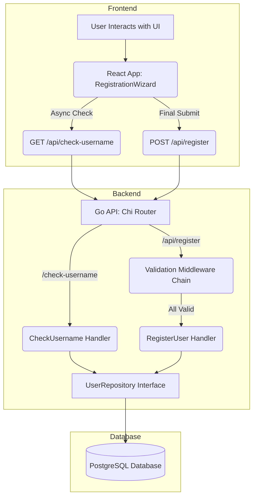

Tyk Task: Multi-Step Registration System

This project is a full-stack, multi-step user registration system built for the Tyk technical assessment. It features a Go backend and a React frontend, deployed in a monorepo structure.

🚀 Features
* Go Backend: A robust JSON API built with chi, featuring a modular validation middleware chain and a configurable repository pattern for database persistence.
* React Frontend: A 4-step wizard built with Vite, React Hook Form for validation, and Context API for state management.
* Full Validation: Includes real-time, client-side validation (on-touch) and comprehensive, server-side validation.
* Async Validation: The "Username" field is checked against the database in real-time as the user types.
* Persistence: All data is securely hashed and saved to a PostgreSQL database, run via Docker.
* Bonus Features: Implements configurable DB credentials (via .env), a health check endpoint, a switchable DB architecture (Repository Pattern), and email/country domain validation.

🛠 Tech Stack
* Backend: Go (Golang), chi (router), pgx (PostgreSQL driver), godotenv, bcrypt
* Frontend: React, Vite, React Hook Form, Context API, axios
* Database: PostgreSQL (managed with Docker Compose)

📋 Project Setup & Installation
You must have the following tools installed:
* [Go](https://go.dev/doc/install) (v1.20 or later)
* [Node.js](https://nodejs.org/en) (v18 or later)
* [Docker](https://www.docker.com/products/docker-desktop/) & Docker Compose

Step 1: Clone the Repository
git clone https://github.com/StefanSolves/tyk.git
cd tyk

Step 2: Configure Environment Files (CRITICAL)
This project requires two .env files for security.
 Backend .env:
    * Create a file at /backend/.env
    * Paste this content (use your own secure password):
 DB_USER=admin
 DB_PASSWORD=your_new_secure_password
 DB_HOST=localhost
 DB_PORT=5432
 DB_NAME=tyk_register_db
 
 Root .env (for Docker):
    * Create a file at /tyk/.env (the root folder)
    * Paste this content (use the same password as above):
 DB_USER=admin
 DB_PASSWORD=your_new_secure_password
 DB_NAME=tyk_register_db
 
Step 3: Install Dependencies
 Install Backend (Go) dependencies:
 cd backend
 go mod tidy
 
 Install Frontend (npm) dependencies:
 cd ../frontend
 npm install

▶️ How to Run the Application
You must run the database, backend, and frontend. You will need two active terminals.
Important: Before you begin, make sure your Docker Desktop application is running (you've double-clicked the app and it's active).

Terminal 1: Run the Database (from Root)
From the root tyk folder:
docker-compose up -d
(This will start the PostgreSQL database in the background.)

Same Terminal 1 : Run the Backend (Go)
From the /backend folder:
go run main.go
(The server will start on http://localhost:8080.)

Terminal 2: Run the Frontend (React)
From the /frontend folder:
npm run dev
(The application will be available at http://localhost:5173.)

🧪 How to Run Tests

Backend Testing
This project was architected for testability.
Integration Tests (Manual): The primary method of testing was via integration testing using Postman or curl.
1. Run the database and backend.
2. Send requests to the API:
    * GET /health: Checks if the server is alive.
    * POST /api/register: Send a valid JSON payload to create a user (returns 201).
    * POST /api/register: Send an invalid payload (e.g., short password) to test the validation chain (returns 422).
    * GET /api/check-username?username=taken: Checks if a username is available.

Security Testing:
* SQL Injection: The application is secure against SQL Injection by using parameterized queries ($1, $2, etc.) via the pgx driver. All user input is treated as literal text, not executable commands.

Frontend Testing (End-to-End)
1. Open http://localhost:5173.
2. Test Step 1: Try to click "Next" with empty fields (fails). Fill with valid data (passes).
3. Test Step 2: Go "Previous" (data persists). Click "Next" (fails). Fill out address (passes).
4. Test Step 3: Test async username validation (e.g., testuser). Test password mismatch. Test "Terms" checkbox validation.
5. Test Step 4: Review data and click "Submit".
6. Test Success: See the "Submitting..." loading state, followed by the "Registration Successful!" message and a form reset.
7. Test Failure: Re-submit with the same username/email. The form will show a 422 error message from the API.

## 🏛 Architectural Decisions & Trade-offs

This section explains the "why" behind the technology choices, as requested in the interview prompt.

### 1. Backend: `chi` + Modular Middleware
* **Choice:** Go `chi` router.
* **Rationale:** The task explicitly required a modular middleware chain. `chi` is a lightweight, high-performance router that fully supports standard `net/http` handlers. Its key feature is its clean API for composing middleware, which allowed me to build the validation chain in a testable, "pluggable" way (e.g., `mw.ValidatePasswordStrength`) that is decoupled from the final handler.

### 2. Backend: Repository Pattern
* **Choice:** `UserRepository` interface.
* **Rationale:** This fulfills the bonus requirement for a switchable database. The HTTP handlers depend *only* on the interface, not the concrete `PostgresRepository`. This decouples the business logic from the database, makes it easy to add a `MySQLRepository` later, and simplifies unit testing by allowing for a mock repository.

### 3. Frontend State: Context API + `useReducer`
* **Choice:** React Context API + `useReducer` hook.
* **Rationale:** This was chosen over Redux as it is the ideal solution for managing complex state that is *local* to a single component tree (the wizard). It solves prop-drilling for all form data and the current step, without the boilerplate and global scope of a library like Redux.

### 4. Frontend Forms: `react-hook-form`
* **Choice:** `react-hook-form`.
* **Rationale:** This is the industry-standard, performance-first library for form management. It uses uncontrolled components to reduce re-renders and handles all validation requirements (real-time, async, and cross-field) out-of-the-box. This allowed me to meet all validation requirements efficiently.

### 5. Frontend Architecture: Atomic Design
* **Choice:** A simple, component-based architecture following Atomic Design principles.
* **Rationale:** Instead of a complex UI library, I focused on a clean architecture. I built reusable **Molecules** (`FormInput`, `FormCheckbox`) which are composed into **Organisms** (`Step1`, `Step2`, etc.). This creates a clean, maintainable, and testable codebase that demonstrates strong software design, while a simple global CSS file provides the "clean and intuitive" UI.

💡 Limitations & Future Improvements
Given the 4-6 hour time constraint, I prioritised a fully functional, end-to-end, and secure MVP. If I had more time, these are the areas I would expand upon:

1. Testing Coverage
Limitation: The project lacks a formal automated test suite.

Backend: I would write Go unit tests for the middleware chain and handlers. The UserRepository interface was designed to be easily mocked, allowing for handler tests without a real database.

Frontend: I would use React Testing Library to write component tests. I would mock the axios calls to test the form's async validation, submission, and error-handling logic. I would also add E2E tests with Cypress or Playwright.

2. Frontend State Persistence
Limitation: If the user refreshes the page, the form state is lost.

Improvement: I would add a simple useEffect hook to sync the FormContext state with sessionStorage. This would persist the data through a refresh without saving it permanently.

3. CI/CD & Deployment
Limitation: The project is run manually.

Improvement: I would build a GitHub Actions pipeline with two jobs:

Frontend: Run tests, build the static assets (npm run build), and deploy to a CDN (like Vercel or an S3 bucket).

Backend: Run tests (go test ./...), build a minimal, static Go binary, and COPY it into a lightweight Docker image (like gcr.io/distroless/static-go). This image would then be pushed to a container registry (ECR/GCR).

4. Production-Ready Infrastructure
Limitation: Credentials are in .env files.

Improvement: In production, I would pull all credentials (DB_PASSWORD, etc.) from a secure secrets manager (like AWS SSM or HashiCorp Vault) at runtime.

Improvement: This server could be refactored to run as Serverless functions (e.g., AWS Lambda with an API Gateway) for better scalability and cost-efficiency.

Improvement: I would add an OpenAPI (Swagger) specification to the backend to formally document the API endpoints.

## 📝 Assumptions Made

* **Clickable Steps:** The progress indicator is intentionally not clickable. This was a deliberate design choice to enforce the validation flow, as the "Next" button is responsible for validating each step. Allowing users to jump forward would break this logic.
* **UK/US Email Bonus:** This validation is performed on the backend during final submission. A future improvement would be to also implement this on the frontend, giving the user real-time feedback in Step 2.
* **Dropdown Data:** The `Country` and `State` dropdown data is hard-coded in the frontend. In a real application, this would likely be fetched from an API.
* **Simple Regex:** The regex for `email` and `phone` validation is intentionally simple for this task. A production app would use a more robust library.
